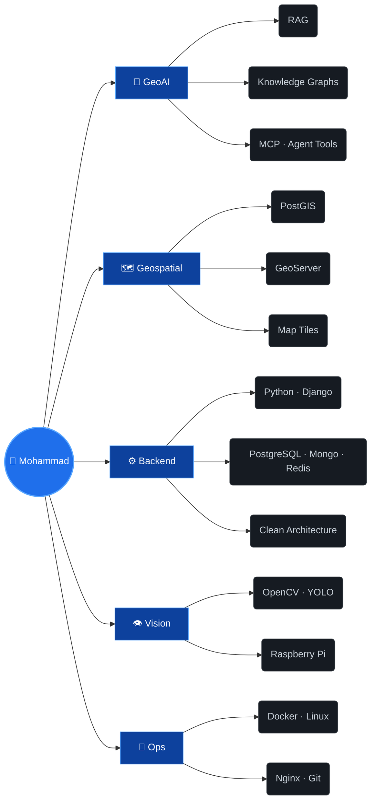

<div align="center">
  
</div>

<p align="center">
  <a href="https://mohammadpooshesh.github.io/"></a>
  <a href="mailto:mohammad.pooshesh@gmail.com"></a>
  <a href="https://www.linkedin.com/in/mohammadpooshesh/"></a>
  <a href="https://twitter.com/mohammadpu6"></a>
</p>

<p align="center">
  
</p>

## 💻 `$ whoami --verbose`

```yaml
name: Mohammad Pooshesh
role: AI Engineer — GeoAI
mission: making AI spatially aware
current_focus:
  - RAG pipelines over geospatial knowledge
  - Knowledge Graphs
  - MCP servers & agent tools
previously:
  - Backend engineering (Python · Django · PostgreSQL/PostGIS)
  - Computer Vision (OpenCV · YOLO · Raspberry Pi)
architecture: clean, always
coordinates: [35.6892, 51.3890]   # Tehran
crs: EPSG:4326
```

## 🗺️ Skill layers

> Rendered like a GIS layers panel — all layers visible.

|     | Layer              | Stack                                          |
| :-: | ------------------ | ---------------------------------------------- |
| ✅  | `L0 · GeoAI`       | RAG · Knowledge Graphs · MCP · Agent Tools     |
| ✅  | `L1 · Geospatial`  | PostGIS · GeoServer · Map Tiles · MBTiles      |
| ✅  | `L2 · Backend`     | Python · Django · Clean Architecture           |
| ✅  | `L3 · Data`        | PostgreSQL · MongoDB · Redis                   |
| ✅  | `L4 · Vision`      | OpenCV · YOLO · Raspberry Pi                   |
| ✅  | `L5 · Ops`         | Docker · Linux · Nginx · Git                   |
| ✅  | `L6 · Frontend`    | HTML · CSS · JS · Django Templates             |

## 🕸️ Knowledge graph (of me)



## 📍 Pinned on the map

| 📍  | Project                                                                              | What it is                                                                          | Stack                    |
| :-: | ------------------------------------------------------------------------------------ | ----------------------------------------------------------------------------------- | ------------------------ |
| 🕐  | **[karnama](https://github.com/mohammadpooshesh/karnama)**                            | Time tracker — cross-platform desktop app built with Flutter                        | `Flutter` `Desktop`      |
| 🗺️  | **[map-tile-downloader](https://github.com/mohammadpooshesh/map-tile-downloader)**    | Docker image for downloading map tiles in PNG & MBTiles formats                     | `Docker` `GIS` `MBTiles` |
| 🔎  | **[DomainHunter](https://github.com/mohammadpooshesh/DomainHunter)**                  | Professional Domain OSINT framework — collects publicly available domain intel      | `Python` `OSINT`         |

## ⚡ Live telemetry

<p align="center">
  
  
</p>

<p align="center">
  
</p>

<picture>
  <source media="(prefers-color-scheme: dark)" srcset="https://raw.githubusercontent.com/mohammadpooshesh/mohammadpooshesh/output/github-snake-dark.svg"/>
  
</picture>

## 📡 Recent transmissions

<!--START_SECTION:activity-->
<!--END_SECTION:activity-->

<sub>⏱️ Auto-updated every 6 hours by GitHub Actions.</sub>

---

<p align="center">
  <sub>🛰️ This profile auto-updates via GitHub Actions · rendered in <code>EPSG:4326</code></sub>
</p>
