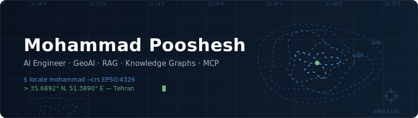

<div align="center">
  
</div>

<p align="center">
  <a href="https://mohammadpooshesh.github.io/"></a>
  <a href="mailto:mohammad.pooshesh@gmail.com"></a>
  <a href="https://www.linkedin.com/in/mohammadpooshesh/"></a>
  <a href="https://twitter.com/mohammadpu6"></a>
</p>

<p align="center">
  
</p>

## `$ whoami --verbose`

```yaml
name: Mohammad Pooshesh
role: AI Engineer — GeoAI
mission: making AI spatially aware
current_focus:
  - RAG pipelines over geospatial knowledge
  - Knowledge Graphs
  - MCP servers & agent tools
previously:
  - Backend engineering (Python · Django · PostgreSQL/PostGIS)
  - Computer Vision (OpenCV · YOLO · Raspberry Pi)
architecture: clean, always
coordinates: [31.8974, 54.3569]   # Yazd
crs: EPSG:4326
```

## Skill layers

<p align="center">
  
</p>

| Layer              | Stack                                      |
| ------------------ | ------------------------------------------ |
| `L0 · GeoAI`       | RAG · Knowledge Graphs · MCP · Agent Tools |
| `L1 · Geospatial`  | PostGIS · GeoServer · Map Tiles · MBTiles  |
| `L2 · Backend`     | Python · Django · Clean Architecture       |
| `L3 · Data`        | PostgreSQL · MongoDB · Redis               |
| `L4 · Vision`      | OpenCV · YOLO · Raspberry Pi               |
| `L5 · Ops`         | Docker · Linux · Nginx · Git               |
| `L6 · Frontend`    | HTML · CSS · JS · Django Templates         |

## GeoAI pipeline

```text
geodata ──▶ PostGIS ──▶ embeddings ──▶ vector index
                                            │
 agents ◀── MCP tools ◀── RAG ◀── knowledge graph
```

- **RAG over geodata** — retrieval grounded in PostGIS + vector search, not vibes
- **Knowledge graphs** — places, entities, and relations that LLMs can actually reason over
- **MCP servers & agent tools** — giving AI agents real GIS superpowers

## Flagship builds

<table>
<tr>
<td width="50%" valign="top">

### ⬡ GeoLab

**Interactive GIS geometry laboratory** — what *regex101* is for regular expressions, GeoLab is for geospatial operations. Draw shapes on a real map, pick an operation, drag a slider — and watch the result update **live**. No Run button, no server, no install.

- **Live preview** — every edit recomputes the result instantly
- **Animation engine** — Buffer, Rotate, Scale & more rendered as scrubbable timeline frames
- **~30 operations** — from Union & Clip to Voronoi, TIN, hulls and grids
- **Code generator** — ready-to-copy equivalents in Turf.js, Shapely & PostGIS
- **Web Worker powered** — heavy geometry off the main thread, UI never freezes

`React` `TypeScript` `MapLibre GL` `Turf.js` `Vite`

<p>
  <a href="https://github.com/mohammadpooshesh/GeoLab"></a>
  
</p>

</td>
<td width="50%" valign="top">

### ◈ GeoForge

**The VS Code for GeoJSON** — a professional GeoJSON IDE that runs entirely in the browser: a Monaco code editor, an interactive MapLibre map, and a VS Code-style feature explorer, all in real-time **bidirectional sync**. 100% client-side, no accounts.

- **Bidirectional editing** — type code → map updates; draw on the map → code updates
- **20+ geometry tools** — Buffer, Union, Simplify, Hulls… all inside a Web Worker
- **Built for scale** — virtualized explorer stays smooth with 50,000+ features
- **Real-time validation** — unclosed rings, non-WGS84 coords, duplicate IDs & more
- **Pro workflow** — property grid, filter expressions, 200-step undo, auto-save

`React` `TypeScript` `Monaco` `MapLibre GL` `Turf.js`

<p>
  <a href="https://github.com/mohammadpooshesh/GeoForge"></a>
  
</p>

</td>
</tr>
<tr>
<td colspan="2" valign="top">

### ⬢ GeoExplain

**Understand spatial SQL visually** — *regex101 for PostGIS*. Draw a geometry (or import GeoJSON), pick a function like `ST_Buffer`, and watch a **step-by-step animation** of exactly what it does to your geometry — alongside live parameters, before/after stats and generated code. Pure client-side visualizer — no real SQL executed. **[Try the live demo →](https://mohammadpooshesh.github.io/GeoExplain/)**

- **30 PostGIS functions** — geometry, measurement, processing, analysis & validation (`ST_Buffer` → `ST_MakeValid`)
- **Step-by-step animations** — buffers grow, unions dissolve, splits pull apart; scrub the timeline both ways
- **4-way code generator** — equivalent PostGIS, Turf.js, Shapely & GDAL/OGR, generated live
- **Zero-dependency engine** — its own computational-geometry core (signed distance fields + marching squares); React is the only runtime library
- **Compare mode** — draggable Before | After curtain, GeoJSON import, SVG / PNG export

`React` `TypeScript` `SVG` `esbuild`

<p>
  <a href="https://mohammadpooshesh.github.io/GeoExplain/"></a>
  <a href="https://github.com/mohammadpooshesh/GeoExplain"></a>
  
</p>

</td>
</tr>
</table>

## More projects

|     | Project                                                                            | What it is                                                                      | Stack                    |
| :-: | ---------------------------------------------------------------------------------- | -------------------------------------------------------------------------------- | ------------------------ |
|  | **[karnama](https://github.com/mohammadpooshesh/karnama)**                         | Time tracker — cross-platform desktop app built with Flutter                    | `Flutter` `Desktop`      |
|    | **[map-tile-downloader](https://github.com/mohammadpooshesh/map-tile-downloader)** | Docker image for downloading map tiles in PNG & MBTiles formats                 | `Docker` `GIS` `MBTiles` |
|    | **[DomainHunter](https://github.com/mohammadpooshesh/DomainHunter)**               | Professional Domain OSINT framework — collects publicly available domain intel  | `Python` `OSINT`         |
|    | **[ai-atlas](https://github.com/mohammadpooshesh/ai-atlas)** | Interactive, fully client-side 3D atlas of 60 AI algorithms — live simulations, math, code & quizzes · | `JavaScript` `WebGL` `PWA` |

## Telemetry

<p align="center">
  
</p>

<p align="center">
  
</p>

<picture>
  <source media="(prefers-color-scheme: dark)" srcset="https://raw.githubusercontent.com/mohammadpooshesh/mohammadpooshesh/output/github-snake-dark.svg"/>
  
</picture>

## Recent transmissions

<!--START_SECTION:activity-->
<!--END_SECTION:activity-->

<sub>Auto-updated every 6 hours by GitHub Actions.</sub>

---

<p align="center">
  <sub>This profile auto-updates via GitHub Actions · rendered in <code>EPSG:4326</code></sub>
</p>
